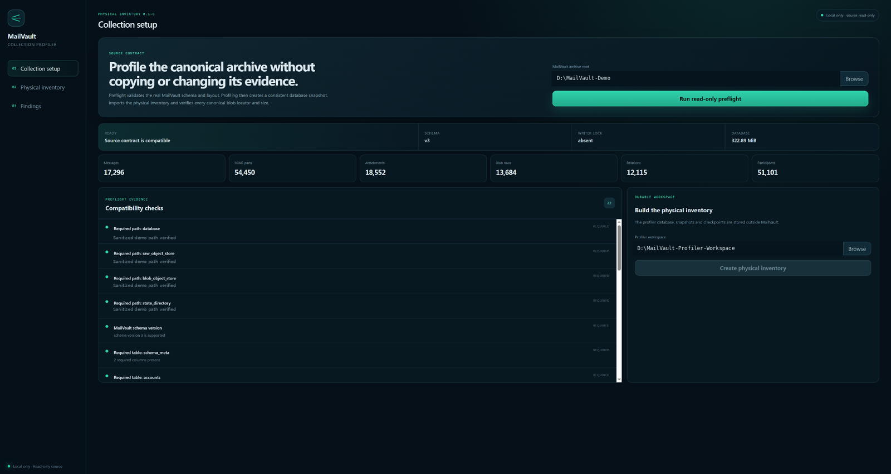
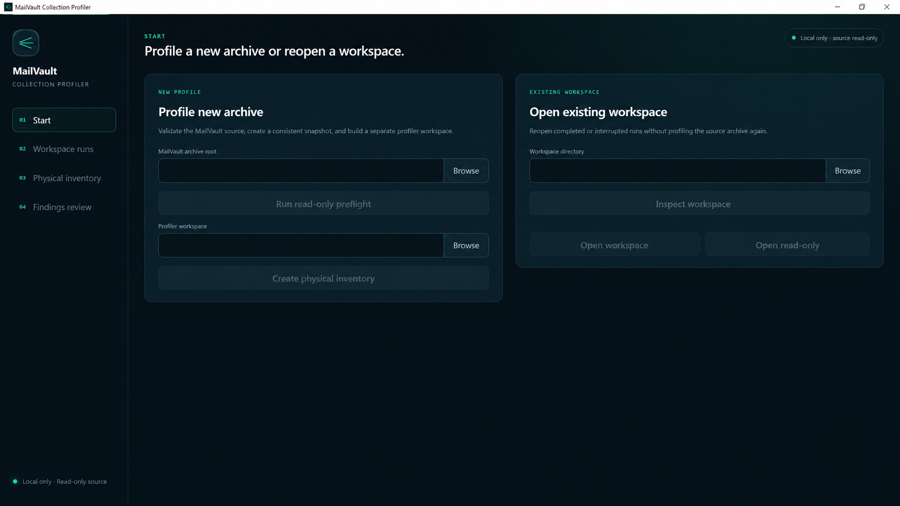
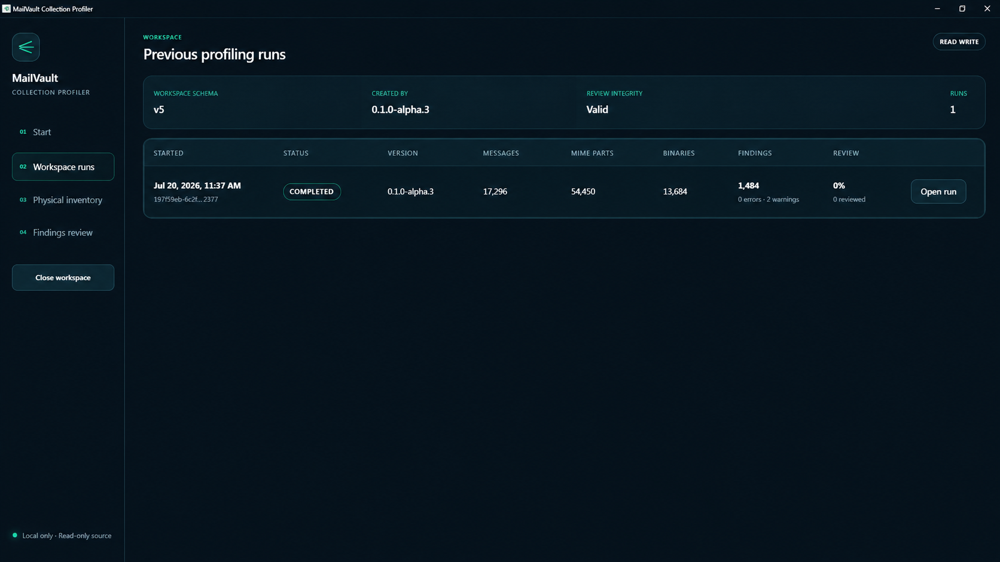
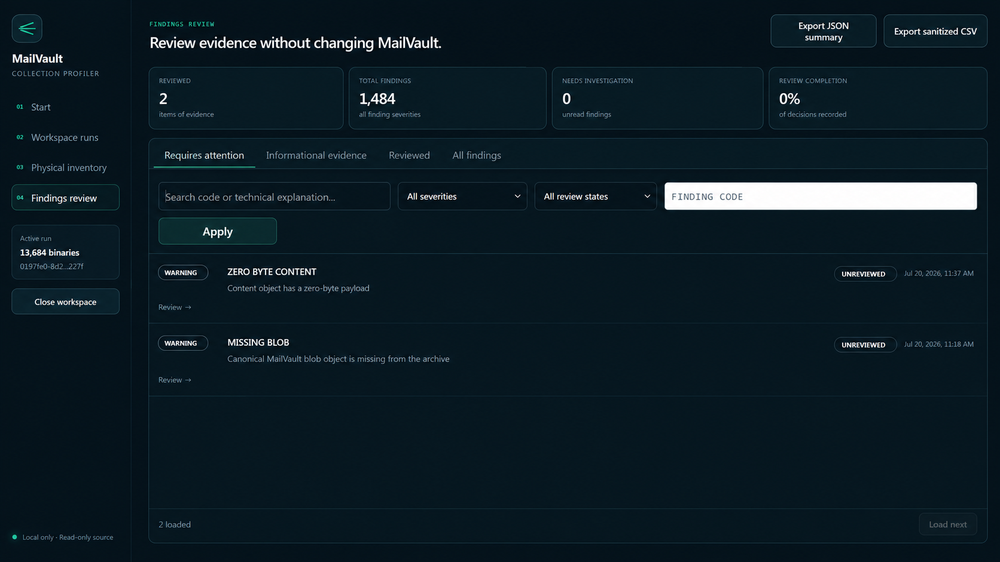
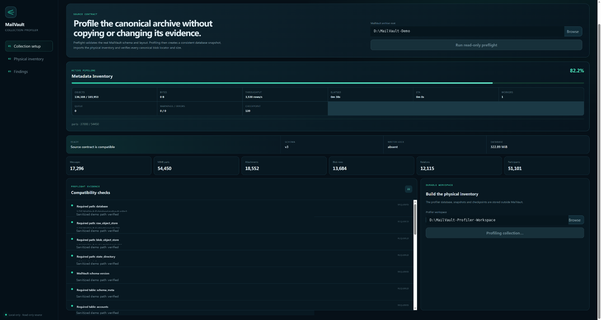
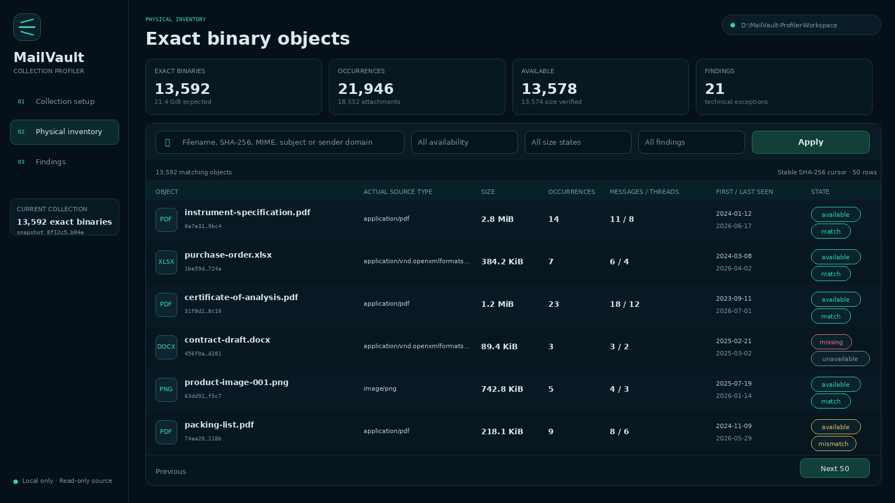
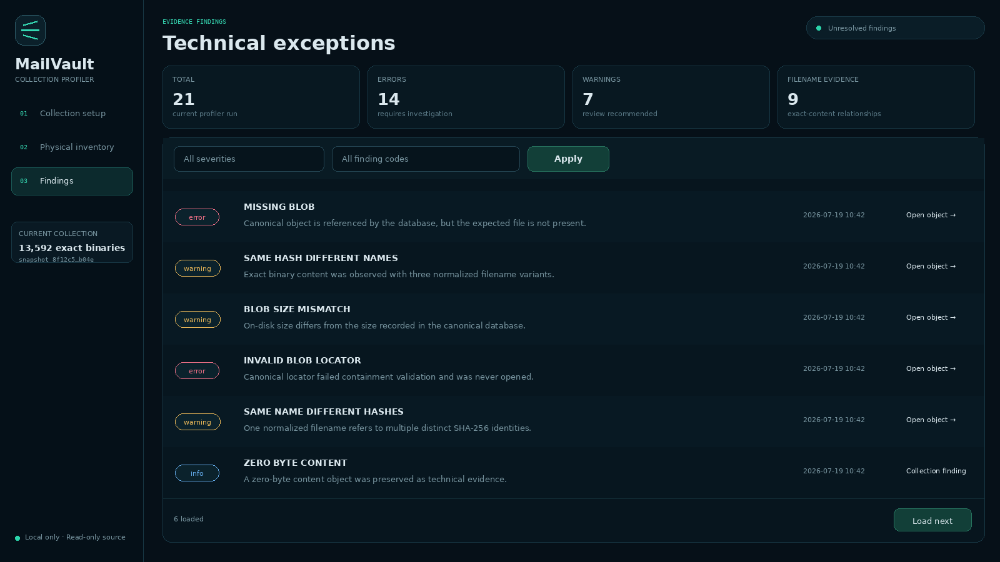
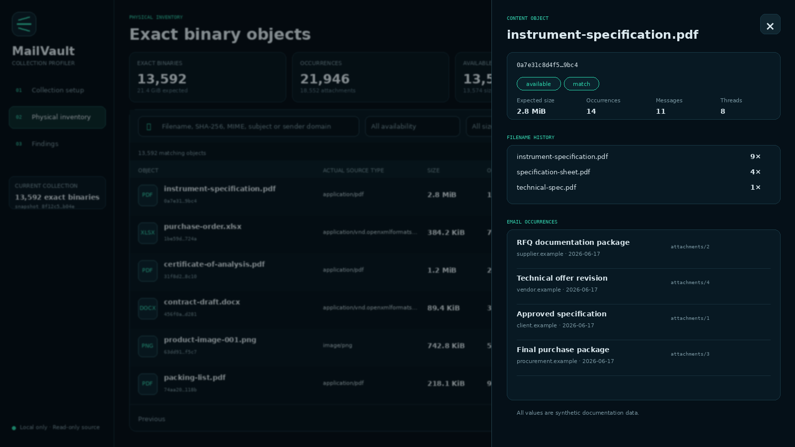
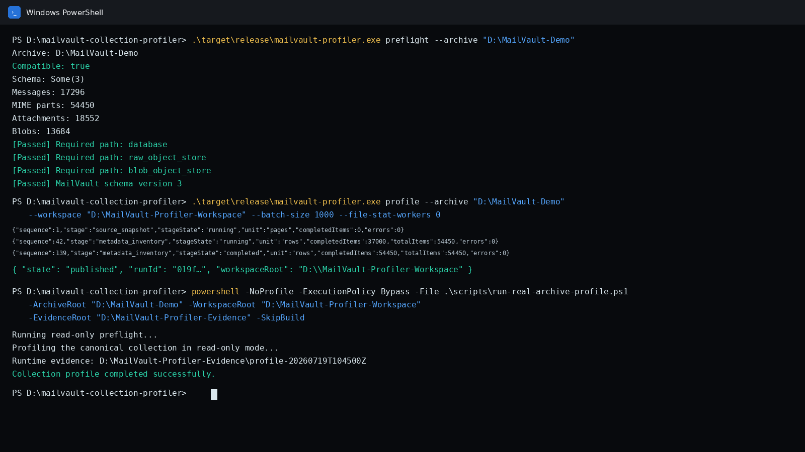

<div align="center">

# MailVault Collection Profiler

**Read-only, local-first physical inventory and technical evidence explorer for MailVault archives.**

[](https://github.com/FireXCore/mailvault-collection-profiler/actions/workflows/ci.yml)
[](https://github.com/FireXCore/mailvault-collection-profiler/actions/workflows/codeql.yml)
[](https://github.com/FireXCore/mailvault-collection-profiler/releases)
[](LICENSE)
[](docs/INSTALLATION_WINDOWS.md)

[فارسی](README_FA.md) · [Download](https://github.com/FireXCore/mailvault-collection-profiler/releases) · [Getting started](docs/GETTING_STARTED.md) · [GUI guide](docs/GUI_GUIDE.md) · [CLI reference](docs/CLI_REFERENCE.md) · [Security](SECURITY.md)

</div>

> **Development alpha.** `0.1.0-alpha.3` is suitable for controlled technical evaluation. The
> Windows installers are currently unsigned. Existing workspaces can now be inspected, migrated,
> reopened after restart, reviewed through append-only finding decisions, and exported in a sanitized
> form. Profiling resume and archive repair remain intentionally unavailable.



## Why this exists

A MailVault archive is more than a folder of attachments. It contains a canonical SQLite database,
message and MIME-part relationships, content-addressed object stores, filenames observed over time,
and physical files that may be missing, unreadable or inconsistent with recorded metadata.

MailVault Collection Profiler builds a reproducible technical inventory without altering the
canonical archive:

```text
read-only preflight
→ consistent SQLite snapshot in a separate workspace
→ streaming metadata inventory
→ attachment-occurrence and SHA-256 reconciliation
→ bounded physical file checks
→ durable findings and checkpoints
→ read-only inventory and findings explorer
```

## Core safety contract

- The canonical MailVault database is opened read-only.
- The profiler workspace must be outside the source archive.
- A consistent SQLite snapshot is created before inventory processing.
- Canonical blob locators are validated before any file is opened.
- Path-containment failures are findings, not paths the profiler follows.
- No attachment is executed, rendered, extracted or uploaded.
- No telemetry or cloud service is required.
- Profiler output is derived metadata and can itself contain sensitive filenames, domains and paths.

See [Security model](docs/SECURITY_MODEL.md), [Privacy](docs/PRIVACY.md) and
[Evidence outputs](docs/EVIDENCE_OUTPUTS.md).

## Implemented in `0.1.0-alpha.3`

- MailVault schema-v3 capability contract and read-only preflight.
- Required path, table, column, index, writer-lock and SQLite integrity checks.
- SQLite Online Backup API snapshot with progress and source-change detection.
- Streaming inventory of messages, MIME parts, participants, relationships and blobs.
- Attachment occurrence preservation and exact SHA-256 content identity.
- Filename normalization and filename-history evidence.
- Same-hash/different-name and same-name/different-hash findings.
- Bounded physical file-stat inspection with conservative automatic worker selection.
- Missing, unreadable, invalid-locator, non-regular and size-mismatch findings.
- Cursor-paginated inventory search by filename, SHA-256, MIME, subject and sender domain.
- Content-object detail with filename variants, message occurrences and technical findings.
- Structured progress events for rows, objects, pages and bytes.
- Windows Tauri desktop application and headless CLI.
- Workspace inspection, compatibility checks and explicit schema migration with a retained backup.
- Reopening completed, failed or interrupted run records after a full application restart.
- Single-writer workspace locking with read-only fallback for concurrent sessions.
- Append-only finding review events with SHA-256 hash-chain integrity and persisted projections.
- Review states: acknowledged, expected, needs investigation and resolved externally.
- Findings separation into requires-attention, informational-evidence, reviewed and all views.
- Sanitized JSON summary and CSV finding export without paths, filenames, email addresses or notes.
- Integration coverage proving restart persistence, lock fallback, sanitized export and source immutability.

## Product tour

### Start and workspace selection



### Reopened profiling runs



### Findings requiring review



### Live physical profile



### Exact binary inventory



### Technical findings



### Content-object evidence




### CLI workflow



All documentation images use sanitized or synthetic paths and metadata. No private archive content
is stored in this repository. See [Screenshot policy](docs/SCREENSHOTS.md).

## Download and install

1. Open the [latest GitHub release](https://github.com/FireXCore/mailvault-collection-profiler/releases).
2. Download the Windows x64 NSIS installer ending in `-setup.exe` or the MSI package.
3. Verify the installer against the attached `SHA256SUMS.txt`.
4. Install the application. An unsigned alpha may trigger Windows SmartScreen.
5. Keep the archive, profiler workspace and runtime evidence in separate directories.

Example layout:

```text
D:\MailVault-Demo
D:\MailVault-Profiler-Workspace
D:\MailVault-Profiler-Evidence
```

Full instructions: [Windows installation](docs/INSTALLATION_WINDOWS.md).

## First profile with the desktop application

1. Stop MailVault synchronization, import or maintenance activity.
2. Select the MailVault archive root.
3. Run **read-only preflight**.
4. Confirm `Source contract is compatible`, schema `v3`, and writer lock `absent`.
5. Select an empty workspace outside the MailVault archive.
6. Create the physical inventory.
7. Review **Physical inventory**, **Findings**, and individual content-object details.

After profiling, the workspace can be reopened from the start screen. Workspace inspection reports
compatibility, migration requirements and lock state before the application opens any run. Older
workspace schemas require explicit confirmation and are backed up before migration.

## CLI quick start

```powershell
.\target\release\mailvault-profiler.exe preflight `
  --archive "D:\MailVault-Demo"
```

Machine-readable preflight:

```powershell
.\target\release\mailvault-profiler.exe preflight `
  --archive "D:\MailVault-Demo" `
  --json
```

Complete profile:

```powershell
.\target\release\mailvault-profiler.exe profile `
  --archive "D:\MailVault-Demo" `
  --workspace "D:\MailVault-Profiler-Workspace" `
  --batch-size 1000 `
  --file-stat-workers 0 `
  --file-stat-batch-size 512 `
  1> profile-result.json `
  2> profile-progress.jsonl
```

Evidence-grade wrapper:

```powershell
powershell -NoProfile -ExecutionPolicy Bypass `
  -File .\scripts\run-real-archive-profile.ps1 `
  -ArchiveRoot "D:\MailVault-Demo" `
  -WorkspaceRoot "D:\MailVault-Profiler-Workspace" `
  -EvidenceRoot "D:\MailVault-Profiler-Evidence"
```

The CLI writes structured progress events to `stderr` and the final profile result to `stdout`.
See [CLI reference](docs/CLI_REFERENCE.md).

## Reopen and review an existing workspace

```powershell
.\target\release\mailvault-profiler.exe workspace inspect `
  --workspace "D:\MailVault-Profiler-Workspace" `
  --json

.\target\release\mailvault-profiler.exe runs list `
  --workspace "D:\MailVault-Profiler-Workspace" `
  --json
```

Review a finding through the CLI:

```powershell
.\target\release\mailvault-profiler.exe findings review `
  --workspace "D:\MailVault-Profiler-Workspace" `
  --run "<run-id>" `
  --finding "<finding-id>" `
  --status needs_investigation `
  --note "Verify the physical object against the retained backup."
```

Export a privacy-safe summary:

```powershell
.\target\release\mailvault-profiler.exe export sanitized-summary `
  --workspace "D:\MailVault-Profiler-Workspace" `
  --run "<run-id>" `
  --output ".\mailvault-profile-sanitized-summary.json"
```

See [Workspace format](docs/WORKSPACE_FORMAT.md) and
[Findings review](docs/FINDINGS_REVIEW.md).

## Validated `0.1.0-alpha.3` run

The alpha.3 release candidate completed a controlled Windows x64 run against a private MailVault
schema-v3 archive. Only aggregate results are published; raw databases, filenames, attachments and
runtime evidence remain private.

| Metric | Recorded |
|---|---:|
| Messages | 17,296 |
| Message occurrences | 17,307 |
| MIME parts | 54,450 |
| Attachment occurrences under the current adapter contract | 18,552 |
| Content objects | 13,684 |
| Content occurrences | 22,068 |
| Blob bytes | 6,467,253,277 |
| Message relationships | 12,115 |
| Participant rows | 51,101 |
| Findings | 1,484 |
| Errors | 0 |
| Warnings | 2 |
| Missing objects | 1 |
| Unreadable objects | 0 |
| Size mismatches | 0 |

Source and snapshot aggregate metrics matched. The workspace reopened after restart, review history
persisted with a valid hash chain, a concurrent writer fell back to read-only, sanitized exports
excluded private paths and row content, and the MailVault source was not modified.

The historical private baseline records 21,946 attachment occurrences in a broader metadata scope.
The validated alpha.3 adapter run reported 18,552 under its current attachment-role contract. These
are retained as separate metrics and must not be substituted for one another. See
[Validation evidence](docs/VALIDATION_0.1.0-alpha.3.md) and
[Real archive baseline](docs/REAL_ARCHIVE_BASELINE.md).

## Canonical private baseline

The current adapter and acceptance gates are grounded in a supplied private MailVault archive:

| Metric | Observed |
|---|---:|
| Archive scale | approximately 20–30 GB |
| Messages | 17,296 |
| MIME parts | 54,450 |
| Attachment occurrences | 21,946 |
| Unique attachment SHA-256 values | 13,592 |
| Blob rows | 13,684 |
| Message relationships | 12,115 |
| Participant rows | 51,101 |

These values are release evidence, not hard-coded compatibility requirements. Details are in
[`docs/REAL_ARCHIVE_BASELINE.md`](docs/REAL_ARCHIVE_BASELINE.md).

## Build from source

Required:

- Rust `1.97.1` as pinned by `rust-toolchain.toml`;
- Node.js `24.x` required;
- npm `11+`;
- Visual Studio 2026/Build Tools with **Desktop development with C++**;
- Windows 10/11 SDK and WebView2 Runtime.

Run builds from an x64 Visual Studio Developer Command Prompt:

```cmd
call "C:\Program Files\Microsoft Visual Studio\18\Community\Common7\Tools\VsDevCmd.bat" -arch=amd64 -host_arch=amd64
cd /d D:\mailvault-collection-profiler
npm ci
powershell -NoProfile -ExecutionPolicy Bypass -File .\scripts\quality.ps1
npm run tauri:desktop:bundle
```

Detailed setup: [Development](docs/DEVELOPMENT.md) and
[Windows installation](docs/INSTALLATION_WINDOWS.md).

## Documentation

| Document | Purpose |
|---|---|
| [Documentation index](docs/INDEX.md) | Complete user, security, technical and maintainer documentation map |
| [Getting started](docs/GETTING_STARTED.md) | First safe run from installation to findings review |
| [Windows installation](docs/INSTALLATION_WINDOWS.md) | Installer and source-build prerequisites |
| [GUI guide](docs/GUI_GUIDE.md) | Collection setup, inventory, findings and object detail |
| [CLI reference](docs/CLI_REFERENCE.md) | Commands, options, output streams and exit behavior |
| [Evidence outputs](docs/EVIDENCE_OUTPUTS.md) | Files written by the evidence wrapper and handling rules |
| [Architecture](docs/ARCHITECTURE.md) | Crate boundaries and data flow |
| [Security model](docs/SECURITY_MODEL.md) | Trust boundaries, invariants and threat handling |
| [Privacy](docs/PRIVACY.md) | Local processing and sensitive derived metadata |
| [Troubleshooting](docs/TROUBLESHOOTING.md) | Known Windows, Rust, npm, Tauri and archive errors |
| [Roadmap](docs/ROADMAP.md) | Explicitly implemented and deferred capabilities |
| [Release process](docs/RELEASE_PROCESS.md) | Maintainer release and verification procedure |
| [راهنمای انتشار در GitHub](docs/GITHUB_PUBLISHING_GUIDE_FA.md) | راهنمای فارسی کامل برای تنظیم مخزن و انتشار Release |
| [تحویل آماده‌سازی مخزن](docs/REPOSITORY_RELEASE_HANDOFF_FA.md) | ترتیب عملی Push، تنظیم Labelها، Gate و Release |

## Project status and limitations

Not implemented in this release:

- resume of an interrupted profiling pipeline and user-facing pause/cancel controls;
- full SHA-256 fixity passes;
- Siegfried/PRONOM exact format identification;
- container expansion and JHOVE validation;
- OCR, semantic extraction, embeddings, LLM or procurement classification;
- automatic application updates;
- signed Windows installers.

See [Implementation status](docs/IMPLEMENTATION_STATUS.md) and [Roadmap](docs/ROADMAP.md).

## Contributing and support

Read [CONTRIBUTING.md](CONTRIBUTING.md) before changing evidence contracts, snapshot behavior,
canonical locator handling or profiler migrations. Use the structured issue forms and never attach
real archives, EML files, attachments, profiler databases or sensitive logs.

- Support: [SUPPORT.md](SUPPORT.md)
- Security reporting: [SECURITY.md](SECURITY.md)
- Code of conduct: [CODE_OF_CONDUCT.md](CODE_OF_CONDUCT.md)

## License

Apache License 2.0. See [LICENSE](LICENSE) and [NOTICE](NOTICE).
