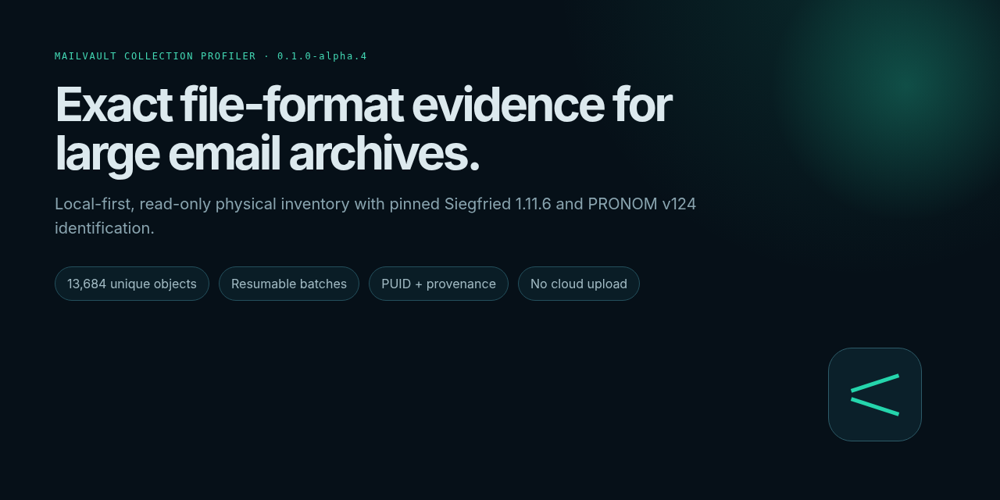
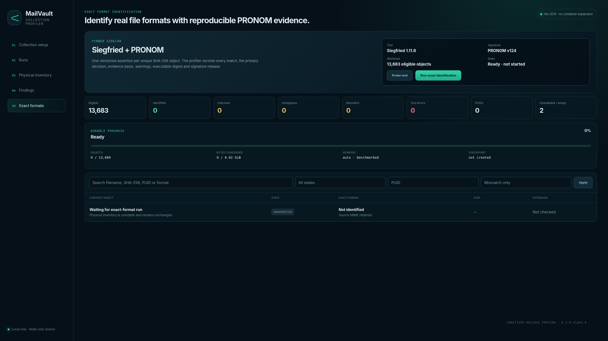
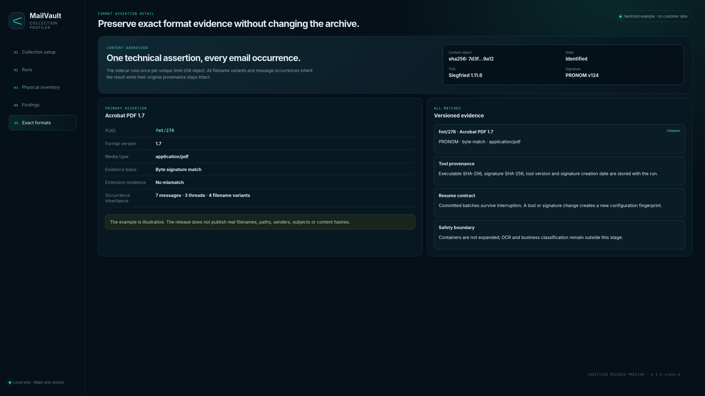
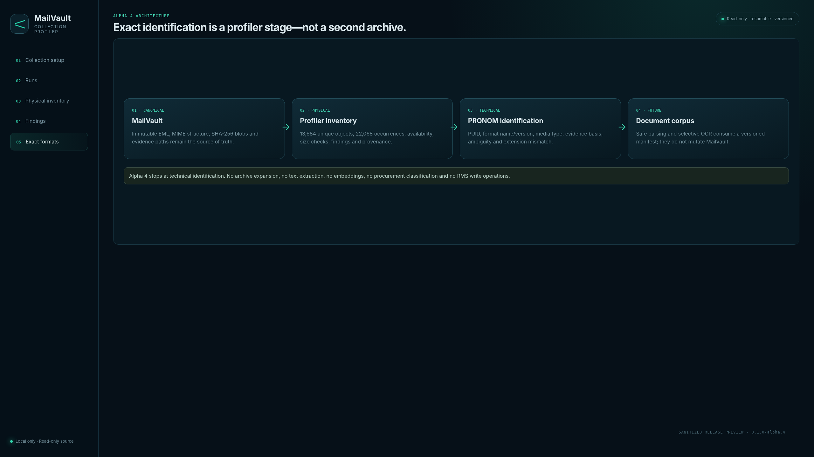

<div align="center">



# MailVault Collection Profiler

**Local-first, read-only physical inventory and exact file-format evidence for MailVault archives.**

[](https://github.com/FireXCore/mailvault-collection-profiler/actions/workflows/ci.yml)
[](https://github.com/FireXCore/mailvault-collection-profiler/actions/workflows/codeql.yml)
[](https://github.com/FireXCore/mailvault-collection-profiler/releases)
[](LICENSE)
[](docs/INSTALLATION_WINDOWS.md)

[فارسی](README_FA.md) · [Download](https://github.com/FireXCore/mailvault-collection-profiler/releases) · [Getting started](docs/GETTING_STARTED.md) · [Exact formats](docs/FORMAT_IDENTIFICATION.md) · [CLI](docs/CLI_REFERENCE.md) · [Security](SECURITY.md)

</div>

> **Development pre-release:** `0.1.0-alpha.4` adds exact format identification as a versioned,
> resumable profiler stage. Windows release builds bundle a pinned Siegfried `1.11.6` sidecar and
> PRONOM `v124` signature database. The source archive remains read-only. Installers are unsigned.

## What the product does

MailVault preserves canonical email evidence. Collection Profiler creates a rebuildable technical
index over that evidence:

```text
MailVault archive (read-only)
  → consistent SQLite snapshot
  → physical content inventory
  → exact SHA-256 identity and occurrence history
  → bounded file-stat verification
  → exact format identification with PUID evidence
  → searchable desktop and CLI views
```

The profiler does not download mail, mutate MailVault, execute attachments, perform OCR, expand
archives, classify procurement documents or write to RMS.

## Real collection baseline

The architecture and performance envelope are based on the supplied production collection, not
sample-only data:

| Metric | Recorded |
|---|---:|
| Archive scale | approximately 20–30 GB |
| Messages | 17,296 |
| MIME parts | 54,450 |
| Content objects | 13,684 |
| Content occurrences | 22,068 |
| Message relationships | 12,115 |
| Unique blob bytes | 6,467,253,277 |
| Physical inventory findings | 1,484 |
| Physical inventory warnings / errors | 2 / 0 |

Alpha 3 validated the physical inventory on Windows. Alpha 4 preserves that baseline, adds schema
migration `0006` and the exact-format execution contract. A private real-archive format run is still
required before publishing format-distribution performance claims.

## Implemented capabilities

### Source and physical inventory

- MailVault schema-v3 capability preflight and writer-lock checks.
- Read-only SQLite Online Backup snapshot with source-change detection.
- Streaming inventory of messages, participants, MIME parts, relationships and blobs.
- Exact SHA-256 content identity separated from every message/filename occurrence.
- Missing, unreadable, invalid-locator, non-regular, zero-byte and size-mismatch findings.
- Same-hash/different-name and same-name/different-hash evidence.
- Cursor-paginated inventory, content-object detail and append-only finding review.
- Sanitized summary and finding export without local paths, filenames, addresses or review notes.

### Exact format identification — Alpha 4

- One identification job per unique content object, never per duplicate occurrence.
- Pinned Siegfried `1.11.6` executable and PRONOM `v124` signature database.
- Tool and signature SHA-256, version, creation metadata and identifier details recorded per run.
- All matches retained; one deterministic primary assertion selected without hiding ambiguity.
- PUID, format name, format version, MIME, class, evidence basis and warnings persisted.
- Explicit states: identified, unknown, ambiguous, empty, unavailable and tool error.
- Extension evidence recorded only when a safe filename alias was actually evaluated.
- Bounded batch execution, process timeout, output-size limits and adaptive batch isolation.
- Durable checkpoint/resume keyed by configuration fingerprint.
- Exclusive format-stage workspace lock to prevent concurrent writers.
- No archive/container expansion and no attachment rendering.







## Why the sidecar is pinned

Format assertions are evidence. A result is meaningful only when the executable and signature
registry are identifiable and reproducible. The Windows build therefore obtains a specific upstream
release, verifies the GitHub release-asset SHA-256 digest, records the executable/signature hashes,
probes the observed versions and then bundles them as Tauri resources. Runtime identification fails
closed when the required tool or signature version differs.

See [Exact format identification](docs/FORMAT_IDENTIFICATION.md),
[format runbook](docs/FORMAT_IDENTIFICATION_RUNBOOK.md) and
[third-party notices](THIRD_PARTY_NOTICES.md).

## Install

1. Open [GitHub Releases](https://github.com/FireXCore/mailvault-collection-profiler/releases).
2. Download the Windows x64 NSIS installer or MSI.
3. Verify the artifact using `SHA256SUMS.txt`.
4. Keep the MailVault archive, profiler workspace and runtime evidence in separate directories.
5. Stop MailVault write activity before creating a new source snapshot.

```text
E:\MailVault-E
E:\MailVault-Profiler-Alpha4
E:\MailVault-Profiler-Evidence-Alpha4
```

Full instructions: [Windows installation](docs/INSTALLATION_WINDOWS.md).

## CLI workflow

Create or reopen the physical inventory first:

```powershell
.\target\release\mailvault-profiler.exe workspace inspect `
  --workspace "E:\MailVault-Profiler-Alpha4" `
  --json

.\target\release\mailvault-profiler.exe runs list `
  --workspace "E:\MailVault-Profiler-Alpha4" `
  --json
```

Probe the exact-format toolchain:

```powershell
.\target\release\mailvault-profiler.exe formats probe `
  --siegfried ".\tools\siegfried\windows-x86_64\sf.exe" `
  --signature ".\tools\siegfried\windows-x86_64\default.sig" `
  --json
```

Run exact identification against a completed physical baseline:

```powershell
.\target\release\mailvault-profiler.exe formats identify `
  --workspace "E:\MailVault-Profiler-Alpha4" `
  --run "<physical-profile-run-id>" `
  --siegfried ".\tools\siegfried\windows-x86_64\sf.exe" `
  --signature ".\tools\siegfried\windows-x86_64\default.sig" `
  --batch-size 2048 `
  --workers 0 `
  --timeout-seconds 900 `
  --resume true `
  --allow-migration `
  1> format-result.json `
  2> format-progress.jsonl
```

Inspect aggregate and object-level results:

```powershell
.\target\release\mailvault-profiler.exe formats summary `
  --workspace "E:\MailVault-Profiler-Alpha4" `
  --run "<physical-profile-run-id>" `
  --json

.\target\release\mailvault-profiler.exe formats list `
  --workspace "E:\MailVault-Profiler-Alpha4" `
  --run "<physical-profile-run-id>" `
  --state ambiguous `
  --json
```

The CLI writes progress JSONL to `stderr` and the final result to `stdout`.

## Build from source

Requirements:

- Rust `1.97.1` from `rust-toolchain.toml`;
- Node.js `24.x` and npm `11+`;
- Visual Studio/Build Tools with Desktop development with C++;
- Windows SDK and WebView2 Runtime.

```powershell
npm ci
.\scripts\install-siegfried.ps1
.\scripts\quality.ps1
npm run tauri:desktop:bundle
```

The installer build embeds the verified sidecar resources. Generated `sf.exe`, `default.sig` and
`tool-manifest.json` are intentionally not committed to source control.

## Validation status

The following checks were completed in the supplied build environment:

- TypeScript type-check and Vite production build: passed.
- Tree-sitter parse of all Rust source files: passed.
- Alpha 3 real profiler database migration from schema 5 to 6: passed.
- SQLite `quick_check` and `foreign_key_check` after migration: passed.
- Real baseline counts preserved: 13,684 objects, 22,068 occurrences, 1,484 findings.
- Source Alpha 3 profiler database SHA-256 unchanged after migration test.
- Synthetic exact-format projection against the migrated schema: passed.

A Rust toolchain was not available in the current isolated build environment, so local semantic
`cargo check`, Clippy, unit tests, Tauri compilation and a real Siegfried run were not claimed.
GitHub Windows CI and the release workflow are configured to install the pinned sidecar and run the
full Rust/desktop gates before producing installers.

See [Alpha 4 validation evidence](docs/VALIDATION_0.1.0-alpha.4.md).

## Documentation

- [Documentation index](docs/INDEX.md)
- [Getting started](docs/GETTING_STARTED.md)
- [Windows installation](docs/INSTALLATION_WINDOWS.md)
- [GUI guide](docs/GUI_GUIDE.md)
- [CLI reference](docs/CLI_REFERENCE.md)
- [Exact format identification](docs/FORMAT_IDENTIFICATION.md)
- [Exact format runbook](docs/FORMAT_IDENTIFICATION_RUNBOOK.md)
- [Architecture](docs/ARCHITECTURE.md)
- [Workspace format](docs/WORKSPACE_FORMAT.md)
- [Security model](docs/SECURITY_MODEL.md)
- [Privacy](docs/PRIVACY.md)
- [Real archive baseline](docs/REAL_ARCHIVE_BASELINE.md)
- [Release process](docs/RELEASE_PROCESS.md)
- [Alpha 4 release notes](docs/releases/v0.1.0-alpha.4.md)

## Scope intentionally deferred

- interrupted physical-profile resume and pause/cancel controls;
- full payload fixity re-hash;
- archive/container expansion;
- JHOVE structural validation;
- text extraction and selective OCR;
- semantic search, embeddings and LLM processing;
- procurement classification and RMS writes;
- public code-signing and automatic updates.

## License

Apache License 2.0. See [LICENSE](LICENSE), [NOTICE](NOTICE) and
[THIRD_PARTY_NOTICES.md](THIRD_PARTY_NOTICES.md).
